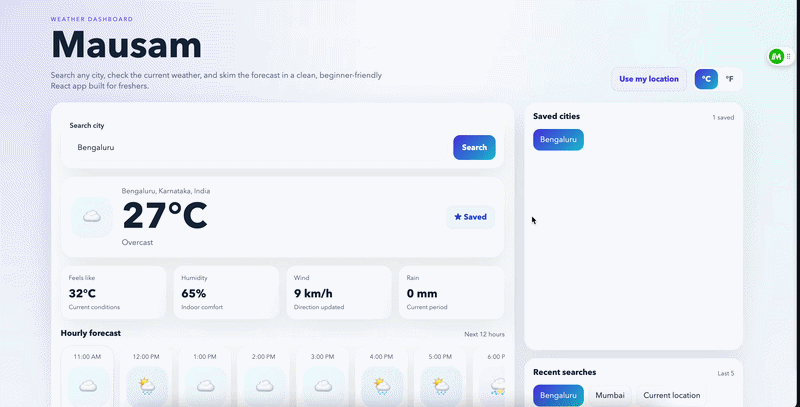

# Mausam

Mausam is a React weather app built with Create React App.

## Features

- Search weather by city
- Weather data from Open-Meteo
- Current conditions card
- Hourly forecast
- 7-day forecast
- Temperature unit toggle
- Use my location button
- Saved cities
- Recent searches
- Local persistence with `localStorage`
- Responsive light-mode UI

## Demo Video



## Tech Stack

- React 18
- Create React App
- Open-Meteo free weather and geocoding APIs
- Plain CSS

## Run Locally

```bash
npm install
npm start
```

## Build

```bash
npm run build
```

## API Notes

- No API token is required.
- The app uses the free Open-Meteo geocoding API to search cities.
- It uses the free Open-Meteo forecast API to load current, hourly, and daily weather.
- The app uses the browser's geolocation coordinates directly for "Use my location."

## Project Structure

```text
weather-app/
├── public/
│   └── index.html
├── src/
│   ├── App.jsx
│   ├── index.js
│   └── styles.css
├── package.json
└── README.md
```
